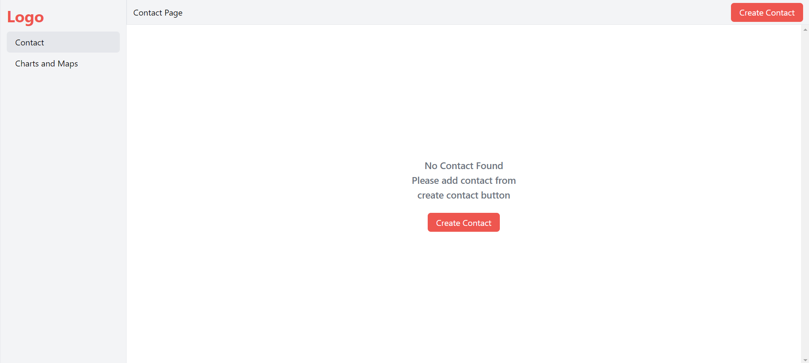
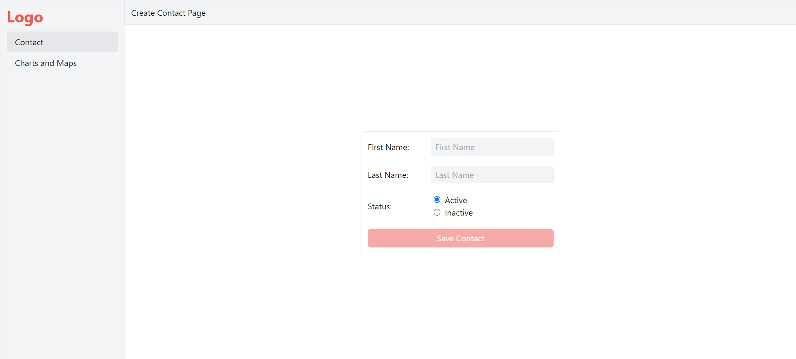
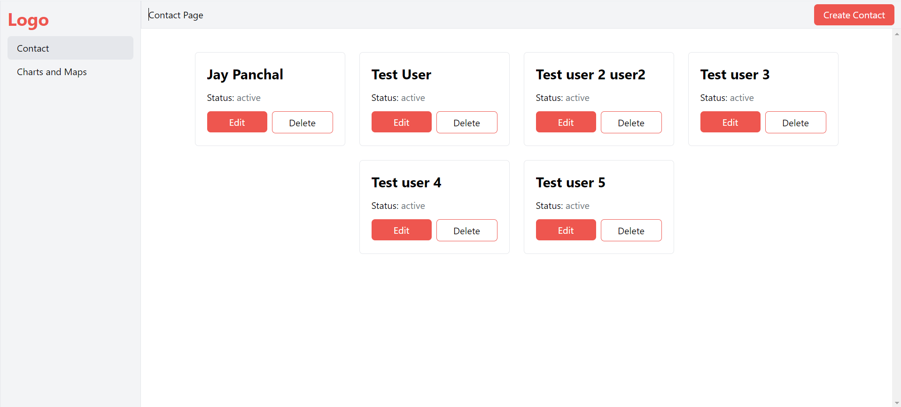
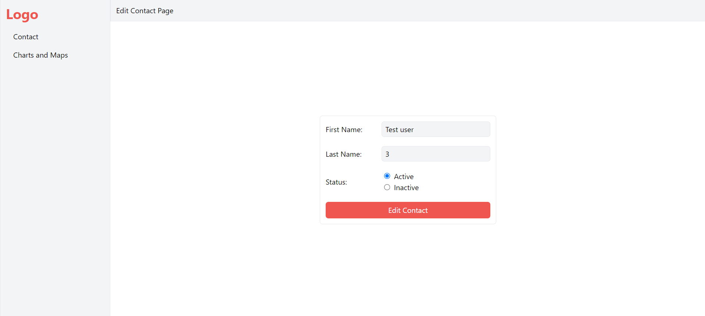
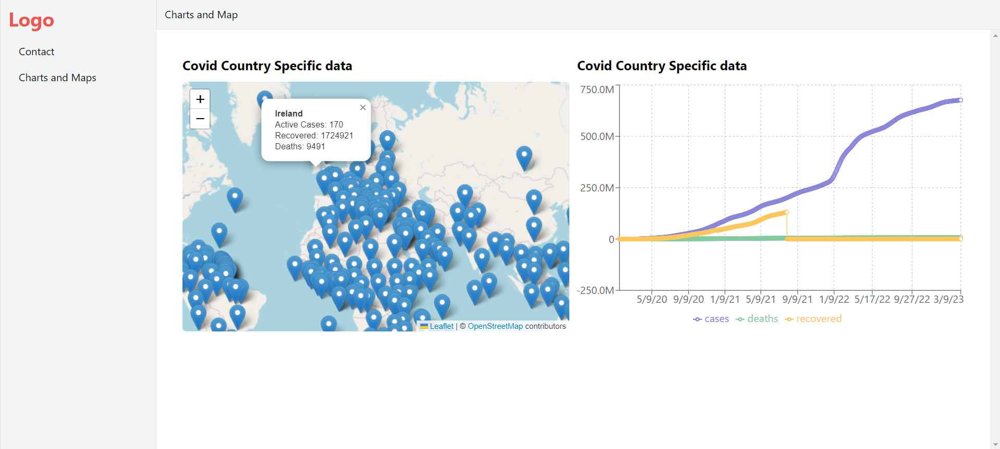
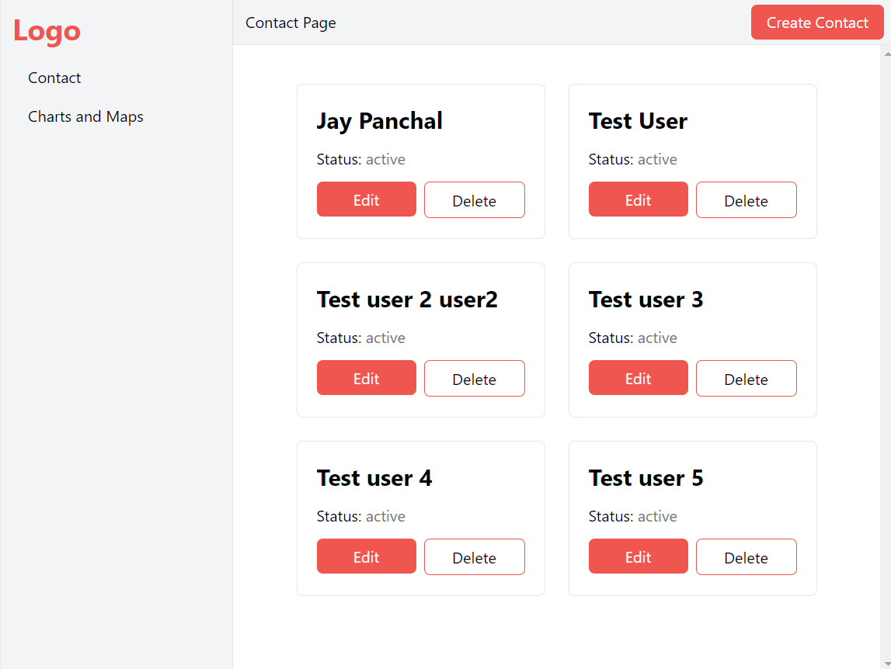
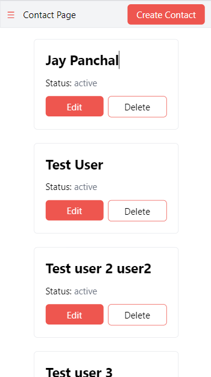
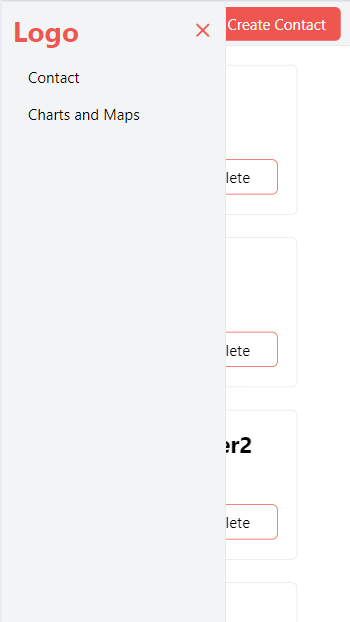
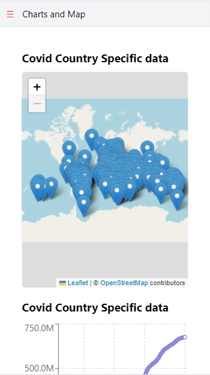

# Taiyo Task App

This app allows you to manage contact and show Charts and Maps for covid19 data

## Installation

1. Clone the repository:

```
git clone https://github.com/JayP09/taiyo-task-app
```

2. Navigate to the project directory and install dependencies:

```
cd taiyo-task-app
yarn
```

3. Start the development server:

```
yarn start
```

Runs the app in the development mode.\
Open [http://localhost:3000](http://localhost:3000) to view it in the browser.

4. Build production build:

```
yarn build
```

Builds the app for production to the `build` folder.\
It correctly bundles React in production mode and optimizes the build for the best performance.

## API Endpoints

- [Country Specific data of cases](https://disease.sh/v3/covid-19/countries)
- [Graph data for cases with date](https://disease.sh/v3/covid-19/historical/all?lastdays=all)

# Demo:










